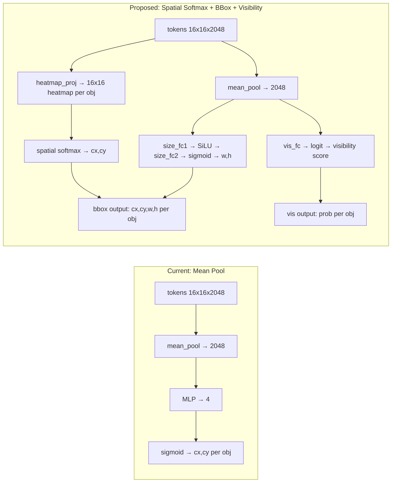

# Spatial Softmax Grounding Head with Bounding Box Prediction

## Problem

The current `GroundingAuxHead` mean-pools all 256 spatial tokens into a single vector, destroying spatial information. This causes the head to learn positional priors (radio is near the arm) rather than visually detecting objects. Additionally, it only outputs center (x, y) instead of a full bounding box.

## Architecture Change



```
┌─────────────────────────────────────────────────────────────────────┐
│  OLD: Mean Pool                                                     │
│                                                                     │
│  tokens [b, 256, 2048] ──► mean_pool ──► MLP ──► sigmoid           │
│                               [b, 2048]   [b,4]   cx,cy per obj    │
└─────────────────────────────────────────────────────────────────────┘

┌─────────────────────────────────────────────────────────────────────┐
│  NEW: Spatial Softmax + BBox + Visibility                           │
│                                                                     │
│                          ┌──────────────────────────────────┐       │
│                          │  heatmap_proj  [b, 256, num_obj] │       │
│                          │       │                          │       │
│                          │  reshape to [b, 16, 16, num_obj] │       │
│                          │       │                          │       │
│                          │  softmax over 16×16 grid         │       │
│                          │       │                          │       │
│                          │  weighted sum ──► cx, cy         │──┐    │
│                          └──────────────────────────────────┘  │    │
│                                                                │    │
│  tokens [b, 256, 2048] ──┤                                     │    │
│                          │                                     ▼    │
│                          │  mean_pool ──► [b, 2048]     ┌──────────┐│
│                          │       │                      │  OUTPUT  ││
│                          ├───────┤                      │          ││
│                          │       │                      │ bbox:    ││
│                          │  size_fc1 ──► SiLU           │ cx,cy,   ││
│                          │       │                      │ w,h      ││
│                          │  size_fc2 ──► sigmoid ──────►│ per obj  ││
│                          │       w, h per obj           │          ││
│                          │                              │ vis:     ││
│                          │  vis_fc ──► logit ──────────►│ prob     ││
│                          │       visibility per obj     │ per obj  ││
│                          │                              └──────────┘│
└─────────────────────────────────────────────────────────────────────┘
```

### Spatial Softmax (center prediction)

Works by:
1. Projecting tokens to a per-object heatmap via 1x1 conv: `[b, 256, 2048] -> [b, 16, 16, num_obj]`
2. Applying softmax over the 16x16 spatial grid to get an attention distribution
3. Computing expected (x, y) as the weighted sum over a fixed coordinate grid
4. This produces (cx, cy) that are **directly tied to spatial locations** in the image

Unlike mean-pooling, spatial softmax preserves the spatial layout of the image. The model must learn to attend to the correct patch where the object is, rather than learning statistical priors about where objects tend to appear.

### Size Prediction (w, h)

Width/height is predicted from the mean-pooled features via a small MLP, since bbox size depends more on distance and object identity than precise pixel localization.

### Visibility Prediction

The old architecture had no mechanism to predict "object not present" -- sigmoid always outputs [0,1] coordinates, and the training loss masked out invisible objects (zero gradient). This meant the model was never penalized for predicting locations of absent objects, so it learned nothing about absence.

The new `vis_fc` layer predicts a raw logit per object, trained with **binary cross-entropy on ALL samples** (both visible and invisible). This teaches the model to actively distinguish presence vs. absence. At inference, boxes are only drawn when visibility probability exceeds 50%.

## Output Format Change

### GT Labels (data pipeline)
- **Old**: `grounding_xy` = float32 `(4,)` = `[radio_cx, radio_cy, table_cx, table_cy]`
- **New**: `grounding_xywh` = float32 `(8,)` = `[radio_cx, radio_cy, radio_w, radio_h, table_cx, table_cy, table_w, table_h]`
- `grounding_visible` = float32 `(2,)` = `[radio_vis, table_vis]` (unchanged, used for both bbox masking and visibility BCE)
- All coordinate/size values normalized to [0, 1]

### Model Output
- **bbox**: `[b, num_objects * 4]` = `(cx, cy, w, h)` per object, in [0, 1]
- **vis_logits**: `[b, num_objects]` = raw logits (pre-sigmoid), trained with BCE

## Training Loss

```
grounding_loss = bbox_loss + vis_loss
```

- **bbox_loss**: SmoothL1 on `(cx, cy, w, h)`, **masked by visibility** -- only penalizes when the object is actually in the frame. This prevents the model from learning to predict positions for invisible objects.
- **vis_loss**: Binary cross-entropy on visibility logits vs. `grounding_visible`, applied to **ALL samples** (visible and invisible). This is the key addition -- the model is actively trained to distinguish present vs. absent objects.

### Training Metrics
- `aux_grounding_l1`: mean SmoothL1 for visible objects (bbox quality)
- `aux_grounding_vis_loss`: BCE for visibility prediction
- `aux_grounding_vis_acc`: classification accuracy (predicted visible vs. GT visible)
- `aux_grounding_vis_ratio`: fraction of samples where object is visible

## Files to Change

### 1. GT Computation - `src/openpi/policies/b1k_phase_transforms.py`

- Add hardcoded approximate 3D half-extents for radio and table:
  ```python
  _OBJ_HALF_EXTENTS = {
      "radio": np.array([0.08, 0.06, 0.05]),   # ~16x12x10 cm
      "table": np.array([0.40, 0.30, 0.02]),   # ~80x60x4 cm
  }
  ```
- Add `_project_bbox_to_normalized()`: projects 8 AABB corners to 2D, takes the min/max to get a 2D bounding box, returns `(cx, cy, w, h, visible)`
- Update `ComputeGroundingLabels` to produce `grounding_xywh` (8,) and keep `grounding_visible` (2,) unchanged

### 2. Model Architecture - `src/openpi/models/pi0.py`

- Replace `GroundingAuxHead` class with new spatial softmax + visibility architecture:
  - `heatmap_proj`: `nnx.Linear(in_dim, num_objects)` -- projects each of the 256 spatial tokens to a per-object logit, reshaped to `[b, 16, 16, num_obj]` heatmap
  - Fixed coordinate grid: `[16, 16]` normalized positions (`(i + 0.5) / 16` for both x, y)
  - Spatial softmax over the 16x16 grid gives attention-weighted `(cx, cy)` per object
  - `size_fc1`: `nnx.Linear(in_dim, hidden_dim)` with SiLU activation
  - `size_fc2`: `nnx.Linear(hidden_dim, num_objects * 2)` with sigmoid, predicts `(w, h)` per object
  - `vis_fc`: `nnx.Linear(in_dim, num_objects)` -- raw visibility logits per object
  - Output: bbox `[b, num_objects * 4]` (cx, cy, w, h interleaved per object) + vis_logits `[b, num_objects]`
- Update loss computation:
  - Change label key from `grounding_xy` to `grounding_xywh` (float32 `[*b, 8]`)
  - **SmoothL1 loss for bbox**, masked by `grounding_visible` -- only backpropagates for visible objects to avoid learning phantom positions
  - **BCE loss for visibility** on ALL objects (visible AND invisible) -- this is critical so the model learns to predict "not present"
  - Combined: `grounding_loss = bbox_loss + vis_loss`
  - New metrics: `aux_grounding_vis_loss`, `aux_grounding_vis_acc`, `aux_grounding_vis_ratio`

### 3. Config - `src/openpi/models/pi0_config.py`

- No structural changes needed. `grounding_num_objects=2` and `grounding_hidden_dim=512` still apply. The spatial softmax grid size (16) is derived from SigLIP's patch layout (224/14 = 16), not configured.

### 4. Observation type - `src/openpi/models/model.py`

- Update the comment on `aux_labels` to reflect `grounding_xywh` instead of `grounding_xy`

### 5. Probe Script - `scripts/eval_grounding_probe.py`

- Update `run_grounding_head()` to replicate spatial softmax + size MLP + visibility inference (returns bbox + vis_prob tuple)
- Update `draw_predictions()`:
  - Accept `vis_probs` array
  - Only draw full bounding box + label when `vis_prob >= 50%` (label shows confidence, e.g. "RADIO 87%")
  - Draw dim dot + low confidence label when `vis_prob < 50%` (object predicted absent)
- Update checkpoint loading to extract `vis_fc` params alongside `heatmap_proj`, `size_fc1`, `size_fc2`
- Update CSV header to include `{name}_pred_vis` column
- Composite video support: runs grounding on all 3 camera views (head, left_wrist, right_wrist) with per-view visibility predictions

## Checkpoint Compatibility

The new `GroundingAuxHead` has different weights than the old one (`heatmap_proj`, `size_fc1`, `size_fc2`, `vis_fc` replace `fc1`/`fc2`/`fc3`). Old checkpoints cannot be loaded into the new head -- this requires retraining from the Stage 2 checkpoint (the last checkpoint before Stage 3 grounding-focused training).

## Approximate Object Dimensions

Since `task_info` doesn't include AABB extents, we hardcode approximate 3D half-extents. These will be slightly inaccurate but sufficient for training:
- **Radio**: roughly 16cm x 12cm x 10cm (a small boombox)
- **Table**: roughly 80cm x 60cm x 4cm (table top surface)

These can be refined by querying `obj.aabb_extent` in the simulator once and recording the values.

## Implementation Todos

1. [DONE] Update `ComputeGroundingLabels` in `b1k_phase_transforms.py`: add `_project_bbox_to_normalized()`, produce `grounding_xywh` (8,) GT
2. [DONE] Replace `GroundingAuxHead` in `pi0.py` with spatial softmax + size MLP + visibility architecture
3. [DONE] Add BCE visibility loss to training, combined with SmoothL1 bbox loss
4. [DONE] Update `aux_labels` comment in `model.py`
5. [DONE] Update `eval_grounding_probe.py`: spatial softmax inference, visibility-gated drawing, CSV with vis_prob
6. Retrain from Stage 2 checkpoint with new grounding head
